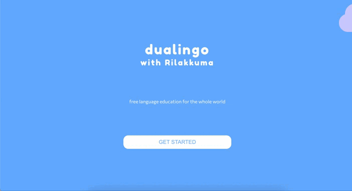

# Dualingo with Rilakkuma

## 💻 Review:

## 🎮 GitPage

- https://github.com/privetigor999/dualingo-app/

## 🛠️ Tools:

- <b>React</b> <i>(основная библиотека)</i>
- <b>Redux ToolKit</b> <i>(наш стейт-менеджмент)</i>
- <b>TypeScript</b> <i>(типизация JavaScript'a)</i>
- <b>axios</b> <i>(будем делать запрос для получения данных)</i>
- <b>React Speech Kit</b> <i>(озвучка текста)</i>
- <b>React Spinners</b> <i>(спиннер во время получения данных)</i>
- <b>React Progress Bar</b> <i>(шкала получения опыта в приложении)</i>
- <b>Redux Persist</b> <i>(все данные будут сохраняться в localStorage)</i>
- <b>sass</b> <i>(стилизация нашего приложения)</i>
- <b>useSound</b> <i>(звуки в приложении: клики, при наведении и т.д.)</i>
- <b>MockApi</b> <i>(здесь хранятся наши данные)</i>

## ℹ️ Описание

Небольшая игра с уровнями, где вы должны помочь японскому медвежонку 🐻 Рилаккуме составить предложения на английском языке. Данная версия включает возможность выбрать только один язык (английский 🇬🇧) из трех представленных (еще французский 🇫🇷 и русский 🇷🇺). На этапе выбора меню вы пишите свое имя и опционально включаете/выключаете звуки в приложении (изначательно включено). Перед вами появится описание задания и само предложение для перевода. В нижней части приложения при помощи клика вы выбираете правильную последовательность перевода предложения, которое всегда добавляется в конец предложения. В случае неверного нажатия вы можете вернуть слово на обратное табло. Так же присутствует возможность включения/выключения звука во время игры 🎵. В случае верного ответа, вы увидите всплывающее окно с вашим опытом, уровнем. После прохождения всех уровней вас будет ждать развлекательное завершение приложения.
